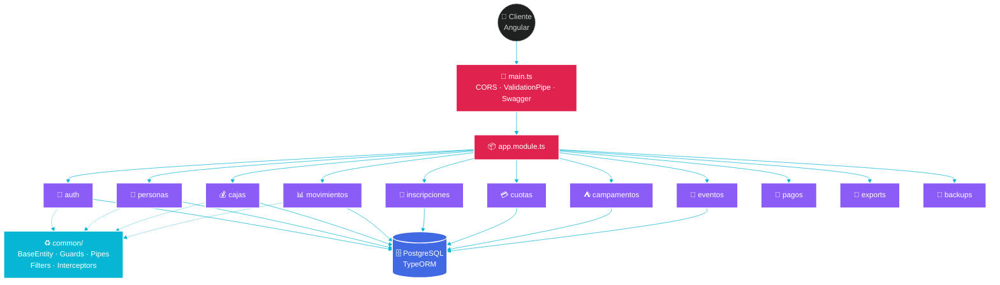
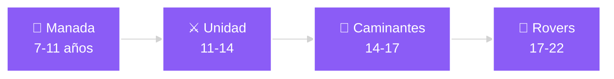

<!-- ══════════════════════════════════════════════════════════════════ -->
<!--                        🌊  HERO BANNER  🌊                         -->
<!-- ══════════════════════════════════════════════════════════════════ -->

<div align="center">


<a href="#-scout--backend">
  
</a>

<br/>

<p>
  
  
  
  
</p>

<p>
  
  
  
  
  
  
  
</p>

</div>

---

# 🚀 Scout — Backend

> **API REST** que sostiene la operación financiera y administrativa de un grupo scout. Centraliza padrón de personas, cajas contables, movimientos, inscripciones, cuotas, campamentos y eventos — con saldos calculados en tiempo real y soft-delete en todas las entidades.

<div align="center">

```
┌─────────────────────────────────────────────────────────────┐
│  🏦 15 conceptos   👥 3 tipos de persona   🌳 4 ramas      │
│  💰 Saldos calculados   🗃 Soft delete   🔐 JWT + Swagger  │
└─────────────────────────────────────────────────────────────┘
```

</div>

---

## 🧭 Tabla de contenidos

<table>
<tr>
<td valign="top" width="50%">

**Producto**
- [🎯 Qué hace](#-qué-hace-este-proyecto)
- [🏦 Modelo de dominio](#-modelo-de-dominio)
- [📚 Documentación de la API](#-documentación-de-la-api)
- [🗺 Roadmap](#-roadmap)

</td>
<td valign="top" width="50%">

**Ingeniería**
- [🛠 Stack técnico](#-stack-técnico)
- [🏗 Arquitectura](#-arquitectura)
- [🚀 Instalación](#-instalación)
- [⚡ Comandos](#-comandos)
- [🧪 Testing](#-testing)
- [🤖 IA · Skills · Agentes](#-desarrollo-asistido-por-ia)
- [🚢 Deploy](#-deploy)

</td>
</tr>
</table>

---

## 🎯 Qué hace este proyecto

> [!TIP]
> **TL;DR** — Es la API REST que usan los educadores y el backoffice del grupo scout para llevar la plata: quién pagó, qué se gastó, cuánto queda en cada caja, quién se inscribió al campamento y quién a Scouts de Argentina.

### ✨ Features principales

| | Feature | Estado |
|:---:|---|:---:|
| 👥 | **Padrón de personas** — protagonistas, educadores y externas | ✅ |
| 💰 | **Cajas contables** — grupo, ramas y cuentas personales | ✅ |
| 📊 | **Movimientos** — ingresos / egresos con 15 conceptos | ✅ |
| 📝 | **Inscripciones** a Scouts de Argentina | ✅ |
| 💳 | **Cuotas** mensuales del grupo | ✅ |
| ⛺ | **Campamentos** con pagos de participantes | ✅ |
| 🎪 | **Eventos** de venta y eventos del grupo | ✅ |
| 📑 | **Exportaciones** a Excel | ✅ |
| 💾 | **Backups** de la base | ✅ |
| 🔐 | **Autenticación** JWT | ✅ |
| 🛡 | **Autorización RBAC** con Casbin | 🚧 |
| 📍 | **Velocidades por ruta** (geolocalización) | 📋 |

<div align="center">

**Leyenda:** ✅ listo · 🚧 en progreso · 📋 planificado

</div>

---

## 🛠 Stack técnico

<div align="center">

<table>
<tr>
<th>Capa</th><th>Tecnología</th><th>Versión</th>
</tr>
<tr><td>⚙️ Runtime</td><td>Node.js</td><td></td></tr>
<tr><td>🐈 Framework</td><td>NestJS</td><td></td></tr>
<tr><td>🔷 Lenguaje</td><td>TypeScript (strict)</td><td></td></tr>
<tr><td>🗄 Base de datos</td><td>PostgreSQL</td><td></td></tr>
<tr><td>🔁 ORM</td><td>TypeORM</td><td></td></tr>
<tr><td>🔐 Auth</td><td>Passport + JWT + bcrypt</td><td></td></tr>
<tr><td>📖 API Docs</td><td>Swagger / OpenAPI</td><td></td></tr>
<tr><td>📊 Exports</td><td>ExcelJS</td><td></td></tr>
<tr><td>🧪 Testing</td><td>Jest + Supertest</td><td></td></tr>
<tr><td>🚢 Deploy</td><td>Railway</td><td></td></tr>
</table>

</div>

---

## 🏗 Arquitectura



### 📁 Estructura del `src/`

```
src/
├── 🚀 main.ts                  Bootstrap (CORS, ValidationPipe, Swagger)
├── 📦 app.module.ts            Módulo raíz
│
├── ♻️  common/                  Código transversal reutilizable
│   ├── entities/               BaseEntity (UUID + timestamps + soft delete)
│   ├── enums/                  Enums de dominio
│   ├── constants/              Constantes de aplicación
│   ├── decorators/             Decoradores custom
│   ├── guards/                 Guards de autorización
│   ├── filters/                Exception filters
│   ├── interceptors/           Request / response interceptors
│   ├── pipes/                  Validation pipes
│   └── utils/                  Helpers
│
├── 🗄  database/                Configuración de TypeORM + seeds
│
└── 🧩 modules/                 Módulos de feature
    ├── 🔐 auth/                Login, JWT, estrategias Passport
    ├── 👥 personas/            Protagonistas · Educadores · Externas
    ├── 💰 cajas/               Caja grupo · fondos rama · personales
    ├── 📊 movimientos/         Ingresos y egresos (15 conceptos)
    ├── 📝 inscripciones/       Scouts de Argentina
    ├── 💳 cuotas/              Cuotas mensuales
    ├── ⛺ campamentos/         Gestión de campamentos
    ├── 🎪 eventos/             Eventos de venta y grupo
    ├── 💸 pagos/               Procesamiento de pagos
    ├── 📑 exports/             Exportaciones a Excel
    ├── 💾 backups/             Backups de base
    └── ⚡ benchmark/           Endpoints de performance
```

### 📐 Estructura estándar por módulo

```
modules/<name>/
├── <name>.module.ts         Declaración NestJS
├── controllers/             HTTP controllers
├── services/                Lógica de negocio
├── entities/                Entidades TypeORM
└── dtos/                    DTOs de request / response
```

---

## 🏦 Modelo de dominio

### 👥 Personas — Single Table Inheritance

Discriminador: columna `tipo`.

<div align="center">

| Tipo | Rango | Cuenta personal | Descripción |
|------|:-----:|:---------------:|-------------|
| 🧒 `Protagonista` | 7–22 años | ✅ | Scout, pertenece a una rama |
| 👨‍🏫 `Educador` | 22+ años | ✅ | Adulto responsable |
| 👨‍👩‍👧 `PersonaExterna` | — | ❌ | Familiar que adelanta dinero |

**Estados:** `activo` · `inactivo`

</div>

### 🌳 Ramas

<div align="center">



</div>

### 💰 Cajas contables

<div align="center">

| Tipo | Descripción |
|------|-------------|
| 🏦 `GRUPO` | Caja central del grupo |
| 🐺 `RAMA_MANADA` | Fondo de la rama Manada |
| ⚔️ `RAMA_UNIDAD` | Fondo de la rama Unidad |
| 🥾 `RAMA_CAMINANTES` | Fondo de la rama Caminantes |
| 🌟 `RAMA_ROVERS` | Fondo de la rama Rovers |
| 👤 `PERSONAL` | Cuenta de un Protagonista o Educador |

</div>

> [!IMPORTANT]
> **Invariante crítica** — `saldoActual` **nunca** se persiste en la base. Siempre se calcula agregando los movimientos de la caja. Esto elimina inconsistencias entre saldo y detalle.

### 📊 Movimientos

- **Tipos:** `ingreso` · `egreso`
- **Medios de pago:** 💵 `efectivo` · 🏧 `transferencia`

<details>
<summary><b>📖 Ver los 15 conceptos disponibles</b></summary>

<div align="center">

| Categoría | Concepto |
|-----------|----------|
| 📝 Inscripciones | `inscripcion` · `inscripcion_pago_scout_argentina` |
| 💳 Cuotas | `cuota_grupo` |
| ⛺ Campamentos | `campamento_pago` · `campamento_gasto` |
| 🛍 Eventos de venta | `evento_venta_ingreso` · `evento_venta_gasto` |
| 🎪 Eventos de grupo | `evento_grupo_ingreso` · `evento_grupo_gasto` |
| 📦 Generales | `gasto_general` · `reembolso` |
| ⚖️ Ajustes | `ajuste_inicial` · `ajuste_bonificacion` |
| 🔄 Internos | `asignacion_fondo_rama` · `transferencia_baja` |

</div>

</details>

### 🧬 Entidad base

Todas las entidades extienden `BaseEntity`:

```typescript
export abstract class BaseEntity {
  @PrimaryGeneratedColumn('uuid')
  id!: string;

  @CreateDateColumn({ type: 'timestamptz' })
  createdAt!: Date;

  @UpdateDateColumn({ type: 'timestamptz' })
  updatedAt!: Date;

  @DeleteDateColumn({ type: 'timestamptz', nullable: true })
  deletedAt!: Date | null;
}
```

> [!TIP]
> Todas las entidades tienen **UUID**, **timestamps con timezone** y **soft delete** desde el momento cero.

---

## 🚀 Instalación

<div align="center">

<table>
<tr>
<th width="15%">1️⃣</th>
<th>Instalar dependencias</th>
</tr>
<tr>
<td align="center"><kbd>npm</kbd></td>
<td>

```bash
npm install
```

</td>
</tr>
<tr>
<th>2️⃣</th>
<th>Configurar entorno</th>
</tr>
<tr>
<td align="center">📄</td>
<td>

```bash
cp .env.example .env.local
# Editar .env.local con credenciales locales
```

</td>
</tr>
<tr>
<th>3️⃣</th>
<th>Levantar Postgres</th>
</tr>
<tr>
<td align="center">🐳</td>
<td>

```bash
docker-compose up -d
```

</td>
</tr>
<tr>
<th>4️⃣</th>
<th>Arrancar la API</th>
</tr>
<tr>
<td align="center">🚀</td>
<td>

```bash
npm run start:dev
```

</td>
</tr>
</table>

</div>

> [!TIP]
> **Ya está** — la API queda disponible en <kbd>http://localhost:3001/api/v1</kbd> y la documentación interactiva de Swagger en <kbd>http://localhost:3001/api/docs</kbd>.

> [!WARNING]
> Nunca commitear `.env.local` ni secretos reales. El archivo está ignorado en `.gitignore`.

---

## ⚡ Comandos

### 🛠 Desarrollo

| Comando | Descripción |
|---------|-------------|
| `npm run start:dev` | 🔥 Servidor en watch mode |
| `npm run start:debug` | 🐞 Servidor con debugger adjuntable |
| `npm run build` | 📦 Compila a `dist/` |
| `npm run start:prod` | 🚀 Corre el build de producción |
| `npm run lint` | 🧹 ESLint con auto-fix |
| `npm run format` | 💅 Prettier sobre `src/` y `test/` |
| `npm run seed` | 🌱 Ejecuta los seeders |

### 🐳 Base de datos (Docker)

| Comando | Descripción |
|---------|-------------|
| `npm run db:test:start` | ▶️ Levanta la base de testing |
| `npm run db:test:stop` | ⏹ Baja la base de testing |
| `npm run db:test:logs` | 📜 Sigue los logs de la base |
| `npm run db:test:reset` | 🔄 Destruye volúmenes y recrea |

---

## 🔐 Variables de entorno

```bash
# Servidor
PORT=3001
NODE_ENV=development

# Base de datos
DB_HOST=localhost
DB_PORT=5432
DB_USERNAME=scout
DB_PASSWORD=scout
DB_DATABASE=scout

# CORS
FRONTEND_URL=http://localhost:4200

# Auth
JWT_SECRET=<secreto>
JWT_EXPIRES_IN=1d
```

> [!CAUTION]
> **JWT_SECRET** debe ser fuerte y único por entorno. Nunca reusar entre dev y prod. Rotar si hay sospecha de exposición.

---

## 🧪 Testing

```bash
npm test                 # Unit tests
npm run test:watch       # Watch mode
npm run test:cov         # Coverage
npm run test:e2e         # End-to-end
```

<div align="center">

| Tipo | Ubicación | Sufijo | Objetivo cobertura |
|------|-----------|--------|:------------------:|
| 🔬 Unit | junto al código | `.spec.ts` | **80%+** |
| 🌐 E2E | `test/` | `.e2e-spec.ts` | endpoints críticos |

</div>

> [!NOTE]
> Los tests E2E usan una **base Postgres dedicada** vía `docker-compose.test.yml`. Correr `npm run db:test:start` antes.

---

## 📚 Documentación de la API

<div align="center">

[](http://localhost:3001/api/docs)

**Swagger UI:** `http://localhost:3001/api/docs`

</div>

Cada controlador documenta sus endpoints con `@ApiTags`, `@ApiOperation` y `@ApiResponse`. Los DTOs exponen sus tipos vía `@ApiProperty`.

---

## 🤖 Desarrollo asistido por IA

<div align="center">


</div>

> [!IMPORTANT]
> Este proyecto está **optimizado para Claude Code**. Skills, agentes y comandos imponen patrones consistentes antes de generar código.

### 🧠 Skills del proyecto

<table>
<tr>
<th>Skill</th><th>Dispara en</th><th>Qué aplica</th>
</tr>
<tr><td>🐈 <code>nestjs</code></td><td>Módulos · services · controllers · guards</td><td>Estructura de módulo · DI · multi-tenancy</td></tr>
<tr><td>🗄 <code>typeorm</code></td><td>Entidades · queries · migraciones · soft deletes</td><td><code>BaseEntity</code> · query builders · migraciones seguras</td></tr>
<tr><td>🛡 <code>casbin</code></td><td>Guards de autorización · políticas RBAC</td><td>Modelo RBAC · policies declarativas</td></tr>
<tr><td>🧪 <code>jest</code></td><td>Unit · integration · e2e tests</td><td>TestBed NestJS · mocks · factories</td></tr>
<tr><td>🔷 <code>typescript</code></td><td>Tipos · interfaces · utility types</td><td><code>const</code> types · sin <code>any</code></td></tr>
<tr><td>📝 <code>commit</code></td><td>Crear commit</td><td>Conventional commits</td></tr>
<tr><td>📜 <code>changelog</code></td><td>Cerrar PR</td><td>Formato keepachangelog.com</td></tr>
<tr><td>📖 <code>docs</code></td><td>Escribir docs</td><td>Guía de estilo y tono</td></tr>
</table>

### 🔄 Skills meta

| Skill | Propósito |
|-------|-----------|
| 🏗 `skill-creator` | Crear un skill nuevo |
| 🔁 `skill-sync` | Regenerar tablas de auto-invoke en `AGENTS.md` |
| 🎯 `workflow` | Orquestar el flujo completo de una feature |
| 🔍 `codebase-analyzer` | Detectar componentes reutilizables |
| 📋 `task-spec` | Validar formato de spec de tarea |
| ✅ `code-quality` | Estándares de calidad (Airbnb-based) |

### ⚡ Auto-invoke

> [!TIP]
> Claude carga el skill **antes** de tocar código:
>
> ```text
> Crear entidad Movimiento         →  typeorm
> Crear MovimientosService         →  nestjs
> Test de MovimientosController    →  jest
> Agregar guard de permiso         →  casbin
> git commit                       →  commit
> ```
>
> Tabla completa en [`AGENTS.md`](../AGENTS.md#auto-invoke-skills).

### 🤖 Agentes especializados

| Agente | Uso |
|--------|-----|
| 🏗 `nestjs-architecture-specialist` | Scaffolding de módulos nuevos |
| 📡 `nestjs-domain-contract` | Diseño de DTOs y Swagger docs |
| 🔴 `tdd-backend-test-designer` | Diseña tests en RED antes de implementar |
| 🟢 `nestjs-test-implementer` | Implementa tests (unit / integration / e2e) |
| 🗄 `data-modeling-specialist` | Revisión de schemas, índices, normalización |
| 🔒 `backend-security-auditor` | OWASP Top 10 · JWT · inyección · CORS |
| 👀 `code-reviewer` | Review contra guidelines |

### ⚡ Comandos

| Comando | Efecto |
|---------|--------|
| `/commit` | Commit con conventional-commits |
| `/review-pr` | Review completa con agentes paralelos |
| `/plan` | Plan paso a paso antes de tocar código |
| `/tdd` | Ciclo RED → GREEN → REFACTOR |
| `/security-review` | Audit de seguridad |
| `/save-session` · `/resume-session` | Persistencia de contexto |

### 🔌 Plugins habilitados

<div align="center">


</div>

### 🪝 Hooks automáticos

> [!TIP]
> **PostToolUse** → Prettier sobre cada `.ts` editado + `tsc --noEmit` incremental
>
> **Stop** → audita `console.log` olvidados antes de cerrar la sesión

---

## 📐 Convenciones

### 📝 Commits

`<tipo>[scope]: <descripción>`

**Tipos:** `feat` · `fix` · `docs` · `chore` · `perf` · `refactor` · `style` · `test`

**Scopes:** `personas` · `cajas` · `movimientos` · `inscripciones` · `cuotas` · `campamentos` · `eventos` · `auth` · `database` · `common`

### 🧬 DTOs y validación

- DTOs en `modules/<name>/dtos/`
- Validar con `class-validator` (`@IsString`, `@IsEnum`, `@IsUUID`, …)
- El `ValidationPipe` global aplica `whitelist`, `transform` y `forbidNonWhitelisted`

### 🛠 Servicios

- Contienen la lógica de negocio
- Devuelven DTOs, **no entidades crudas**
- Usan repositorios de TypeORM y query builders para consultas complejas

> [!WARNING]
> **Soft delete obligatorio** — nunca usar `DELETE` directo. Todas las entidades tienen `deletedAt` y deben eliminarse con `softDelete()` del repositorio.

---

## 🗺 Roadmap

- [x] ✅ Módulos de dominio (personas, cajas, movimientos, inscripciones, cuotas, campamentos, eventos)
- [x] ✅ Exportaciones a Excel
- [x] ✅ Backups
- [x] ✅ Autenticación JWT
- [ ] 🚧 Autorización basada en roles (RBAC con Casbin)
- [ ] 📋 Registro de velocidades geolocalizadas por ruta
- [ ] 📋 Webhooks de notificación
- [ ] 📋 Dashboard de métricas en tiempo real

---

## 🚢 Deploy

<div align="center">

[](https://railway.app)

</div>

Producción corre en **Railway** (ver `railway.json` y `railpack.json`). El pipeline típico:

```bash
npm ci
npm run build
npm run start:prod
```

---

## 📂 Archivos relevantes

| Archivo | Propósito |
|---------|-----------|
| `src/main.ts` | Bootstrap (CORS · pipes · Swagger) |
| `src/app.module.ts` | Módulo raíz |
| `src/common/entities/base.entity.ts` | Entidad base |
| `src/database/database.module.ts` | Configuración de TypeORM |
| `.env.local` | Variables de entorno (no commiteado) |
| `docker-compose.yml` | DB de desarrollo |
| `docker-compose.test.yml` | DB de testing |

---

<div align="center">

### 💙 Hecho con NestJS, TypeORM y Claude Code

<sub>UNLICENSED · Uso interno del grupo scout</sub>


</div>
